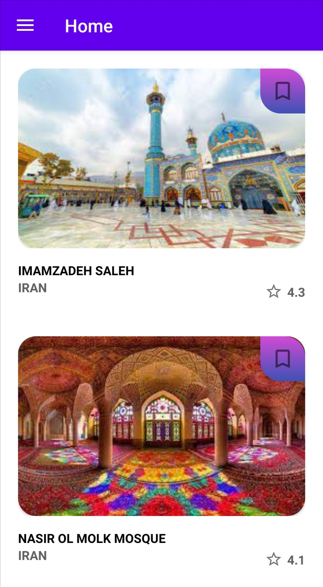
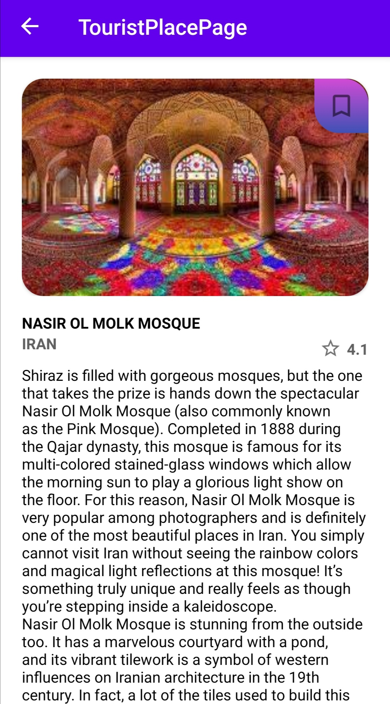
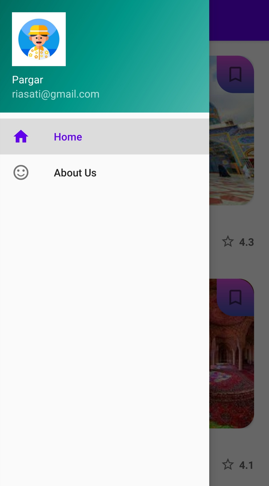
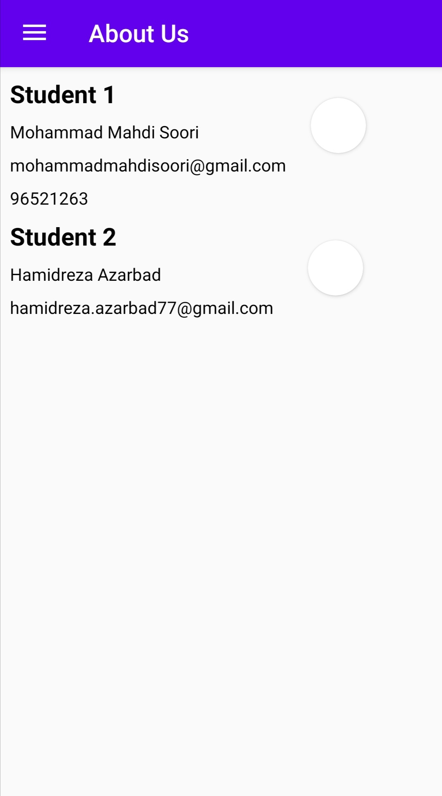

# MobileNetwork 
 

## Description
Project for mobile network class

## Demo

## Authors

- [Hamidreza Azarbad](https://www.github.com/hamidreza7799)
- [Mohammad Mahdi Soori](https://www.github.com/riasati)